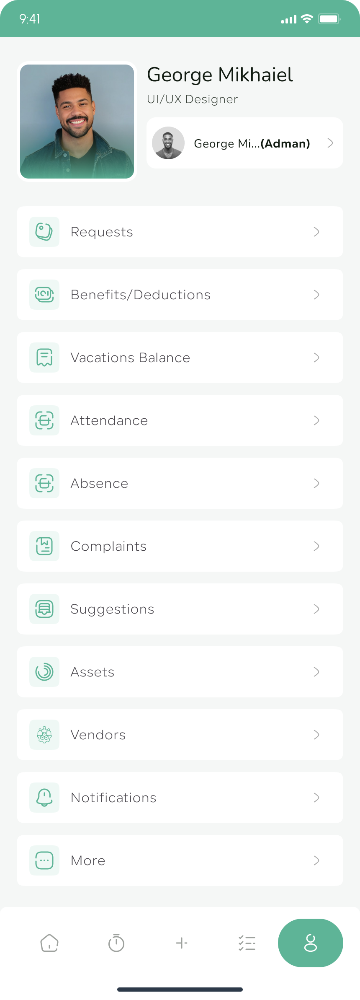

# Employee Features

Everything employees need to know about using My Attend effectively. This guide focuses on the day-to-day features that make attendance tracking simple and convenient.

## Daily Attendance

### Quick Check-in Process

Start your workday with a simple tap:

{width="200"}

#### Step-by-Step Check-in

1. **Open My Attend** when you arrive at work
2. **Tap the large "Check In" button** on your home screen
3. **Confirm your location** if prompted (GPS verification)
4. **See confirmation message** with your check-in time
5. **Your status updates** to "Checked In" with a green indicator

#### What Happens When You Check In

- **Precise timestamp** recorded to the second
- **Location verified** (if enabled by your organization)
- **Daily timer starts** tracking your work hours
- **Notification sent** to supervisors (if configured)
- **Dashboard updates** to show current status

### Quick Check-out Process

End your workday just as easily:

#### Step-by-Step Check-out

1. **Open My Attend** when you're ready to leave
2. **Tap the "Check Out" button** (now prominently displayed)
3. **Review your day's summary** if shown
4. **Confirm the check-out** action
5. **See your total hours** worked for the day

#### Check-out Summary

After checking out, you'll see:

- **Total hours worked** for the day
- **Break time taken** (if applicable)
- **Overtime hours** (if any)
- **Weekly hours total** so far
- **Next scheduled shift** information

## Viewing Your Attendance

### Today's Summary

See your current day's attendance at a glance:

**Dashboard Information:**

- **Check-in time** - When you started work today
- **Current status** - Checked in, on break, or checked out
- **Hours worked** - Running total for today
- **Break time** - Total break duration
- **Scheduled hours** - Your planned work time
- **Overtime status** - Any overtime hours earned

{width="200"}

### Weekly Overview

Track your week's attendance pattern:

**Weekly View Shows:**

- **Each day's hours** worked this week
- **Total weekly hours** accumulated
- **Overtime hours** for the week
- **Attendance rate** (days present vs. scheduled)
- **Upcoming schedule** for rest of the week

### Monthly History

Review your complete attendance history:

1. **Go to Reports** section from bottom navigation
2. **See detailed breakdown** of your attendance:
   - Daily check-in/check-out times
   - Hours worked each day
   - Break times taken
   - Any late arrivals or early departures
   - Leave days taken
   - Overtime hours earned

## Schedule Management

### Viewing Your Schedule

Stay informed about your work schedule:

#### This Week's Schedule

- **Daily start/end times** for each work day
- **Total scheduled hours** for the week
- **Any schedule changes** or updates
- **Upcoming time off** you've requested

#### Future Schedule

- **Next week's hours** and any changes
- **Upcoming holidays** and company closures
- **Scheduled time off** you've been approved for
- **Shift swaps** or temporary changes

### Schedule Notifications

Stay updated with automatic reminders:

**Notification Types:**

- **Shift start reminders** - 15 minutes before your shift
- **Break reminders** - When it's time for scheduled breaks
- **Shift end reminders** - Don't forget to check out
- **Schedule changes** - When your schedule is modified
- **Overtime alerts** - When you're approaching overtime

**Customizing Notifications:**

1. **Go to Profile > Settings**
2. **Tap "Notifications"**
3. **Toggle on/off** different reminder types

## Leave Requests

### Requesting Time Off

Submit leave requests easily through the app:

#### Creating a Leave Request

1. **Go to Schedule** section
2. **Tap "Request Leave"** button
3. **Select your dates**:
   - Start date for your time off
   - End date (or same day for single day)
   - Partial days if needed (half days, etc.)
4. **Choose leave type** from dropdown menu
5. **Add a note** explaining your request (optional but helpful)
6. **Review your request** details
7. **Submit for approval**

{width="200"}

#### Leave Types Available

- **Vacation** - Planned time off for rest and recreation
- **Sick Leave** - Health-related absences
- **Personal Day** - Personal matters requiring time off
- **Other** - Specify custom reason

### Tracking Leave Requests

Monitor the status of your time-off requests:

#### Request Status Types

- **Pending** - Waiting for manager approval
- **Approved** - Time off has been granted
- **Denied** - Request was not approved
- **Partially Approved** - Some but not all days approved
- **Cancelled** - You cancelled the request

#### Request History
View all your past and current leave requests:

- **Request dates** and duration
- **Leave type** and reason provided
- **Approval status** and decision date
- **Manager notes** if any were added
- **Impact on leave balance**

### Leave Balance Tracking

Keep track of your available time off:

#### Current Balances
See how much leave you have available:

- **Vacation days** remaining this year
- **Sick leave** balance
- **Personal days** available
- **Floating holidays** unused
- **Comp time** earned

#### Balance History

- **Leave earned** through accrual
- **Leave used** for approved time off
- **Balance adjustments** made by HR/admin
- **Carryover amounts** from previous year
- **Projected balance** at year end

{width="200"}

## Personal Profile

### Managing Your Information

Keep your profile information current:

#### Personal Details
- **Profile photo** - Upload a professional photo
- **Contact information** - Phone, email, address
- **Emergency contacts** - Important for workplace safety
- **Personal preferences** - Language, time zone, etc.

#### Work Information
- **Job title** and department
- **Employee ID** and start date
- **Work location** and schedule
- **Supervisor information**

### Account Settings

Customize your My Attend experience:

#### App Preferences
- **Theme selection** - Light or dark mode
- **Language** - Choose your preferred language
- **Time format** - 12-hour or 24-hour display
- **Date format** - Regional date preferences
- **Dashboard layout** - Arrange widgets as you prefer

#### Privacy Settings
- **Data sharing** preferences
- **Location tracking** consent
- **Notification** permissions
- **Profile visibility** to other employees

### Security Settings

Keep your account secure:

#### Password Management
- **Change password** regularly for security
- **Password requirements** - Strong password guidelines
- **Two-factor authentication** - Extra security layer (if available)
- **Login history** - See recent account access

#### Device Management
- **Registered devices** - See which devices can access your account
- **Remote logout** - Sign out of all devices if needed
- **Device notifications** - Alerts for new device logins

{width="200"}

## Offline Functionality

### Working Without Internet

My Attend works even when you don't have internet connection:

#### What Works Offline
- **Check-in and check-out** - Actions saved locally
- **View recent attendance** - Last synced data available
- **Basic profile information** - Your details remain accessible

#### Automatic Sync
When your internet connection returns:
- **Offline actions upload** automatically
- **Latest data downloads** from the server
- **Conflicts resolved** intelligently
- **Notifications catch up** - Any missed alerts appear

### Offline Best Practices

Make the most of offline functionality:

- **Check in promptly** when you arrive, even without internet
- **Don't worry about connectivity** - Your data is safe
- **Sync regularly** when internet is available
- **Keep the app updated** for best offline performance

## Tips for Success

### Daily Habits

Develop good attendance tracking habits:

- **Check in immediately** when you arrive at work
- **Don't forget breaks** - Track them for accurate records
- **Check out promptly** when leaving work
- **Review your daily summary** before leaving
- **Keep your phone charged** to avoid missing check-ins

### Weekly Reviews

Stay on top of your attendance:

- **Review weekly hours** every Friday
- **Check for any missing entries** and report them
- **Plan upcoming leave** requests in advance
- **Monitor overtime hours** to stay within limits
- **Update your schedule** if there are changes

### Monthly Planning

Use attendance data for planning:

- **Review monthly patterns** to identify trends
- **Plan vacation time** based on available balance
- **Discuss schedule needs** with your supervisor
- **Set attendance goals** for improvement
- **Keep personal records** for your own tracking

## Troubleshooting

### Common Issues

**Can't check in:**
- Ensure you're at the correct work location
- Check your internet connection
- Verify GPS/location services are enabled
- Try restarting the app

**Missing check-in or check-out:**
- Contact your supervisor or admin immediately
- Provide the correct times for manual entry
- Explain the circumstances that caused the issue
- Keep documentation if it was due to system problems

**Notifications not working:**
- Check notification permissions in device settings
- Ensure notifications are enabled in app settings
- Verify your contact information is correct
- Try logging out and back in

**App running slowly:**
- Close other apps to free up memory
- Restart your device
- Update to the latest app version
- Clear app cache if the problem persists

### Getting Help

When you need assistance:

1. **Check the FAQ** - Many common questions are answered there
2. **Ask your supervisor** - They may have organization-specific guidance
3. **Use in-app help** - Tap the help icon in any section
4. **Contact support** - Email [info@tettra.solutions](mailto:info@tettra.solutions)

---

*Ready to make the most of My Attend? Start with your [daily check-in](#quick-check-in-process) and explore the features that work best for you!*